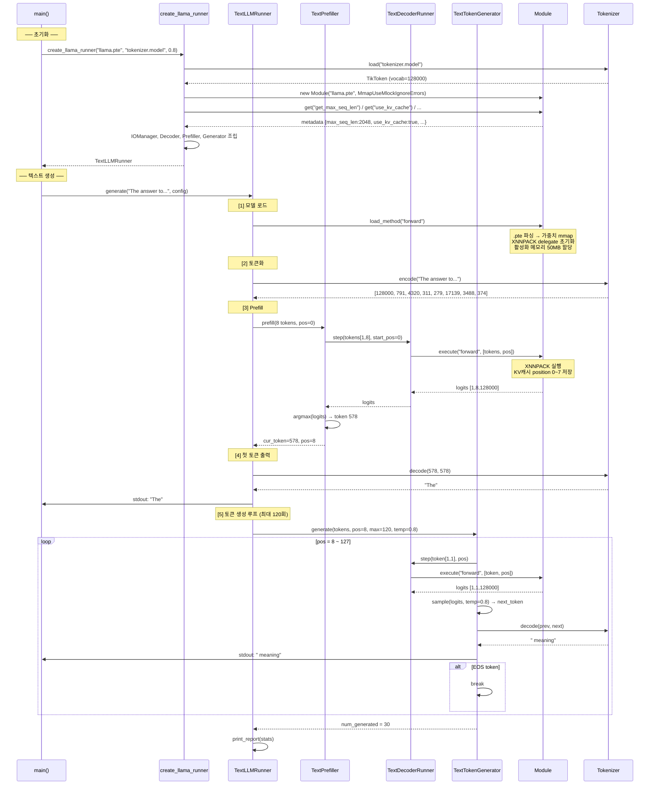

# TextLLMRunner 시퀀스 다이어그램

> 예시 값: LLaMA 3 8B, prompt 8토큰, XNNPACK, max_seq_len=2048, temperature=0.8

---

## 1. 간략 버전 (핵심 흐름만)



---

## 2. 상세 버전

```mermaid
sequenceDiagram
    participant Main as main.cpp
    participant GFlags as gflags
    participant TP as ThreadPool
    participant Factory as create_llama_runner()
    participant TokLoader as load_tokenizer()
    participant Tokenizer as TikToken
    participant Mod as Module
    participant Prog as Program
    participant DL as MmapDataLoader
    participant Meta as get_llm_metadata()
    participant EOS as get_eos_ids()
    participant Runner as TextLLMRunner
    participant Prefiller as TextPrefiller
    participant Decoder as TextDecoderRunner
    participant IOMgr as IOManager
    participant Generator as TextTokenGenerator
    participant Sampler as Sampler
    participant Stats as Stats
    participant Method as Method (XNNPACK)

    Note over Main,Method: ════════ Phase 1: 커맨드라인 파싱 & 스레드풀 설정 ════════

    Main->>GFlags: ParseCommandLineFlags()
    Note right of GFlags: model_path="llama.pte"<br/>tokenizer_path="tokenizer.model"<br/>temperature=0.8, seq_len=128

    Main->>TP: get_num_performant_cores()
    TP-->>Main: 4 cores
    Main->>TP: reset_threadpool(4)

    Note over Main,Method: ════════ Phase 2: Runner 생성 (create_llama_runner) ════════

    Main->>Factory: create_llama_runner("llama.pte", "tokenizer.model", 0.8)
    Factory->>TokLoader: load_llama_tokenizer("tokenizer.model", Default)

    Note over TokLoader: get_special_tokens(Default)
    TokLoader->>TokLoader: 256개 특수 토큰 생성<br/>["<|begin_of_text|>", "<|end_of_text|>", ...]
    TokLoader->>Tokenizer: new Tiktoken(special_tokens, bos=0, eos=1)
    TokLoader->>Tokenizer: load("tokenizer.model")
    Note over Tokenizer: base64 BPE 테이블 파싱<br/>128000 일반 토큰 + 256 특수 토큰<br/>bos=128000, eos=128001
    Tokenizer-->>Factory: tokenizer (vocab=128256)

    Factory->>Mod: new Module("llama.pte", MmapUseMlockIgnoreErrors)
    Note over Mod: runtime_init() 호출<br/>파일 경로와 LoadMode만 저장<br/>(아직 로드 안 함)

    Note over Factory,Prog: ── 메타데이터 추출 ──
    Factory->>Meta: get_llm_metadata(tokenizer, module)
    Meta->>Mod: method_names()
    Mod->>Mod: load() ← 최초 호출 시 실행

    Note over Mod,DL: Module::load_internal()
    Mod->>DL: MmapDataLoader::from("llama.pte")
    Note over DL: mmap("llama.pte", 4.5GB)<br/>mlock() 시도 (실패 무시)
    DL-->>Mod: DataLoader

    Mod->>Prog: Program::load(data_loader, Minimal)
    Note over Prog: [1] Extended Header 읽기 (64B)<br/>    program_size=50MB<br/>    segment_base_offset=50MB+64<br/>[2] FlatBuffer 로드 (50MB, 제로카피)<br/>[3] "ET12" 매직 검증 ✓<br/>[4] constant_segment 매핑<br/>    가중치 4.3GB mmap 포인터 획득
    Prog-->>Mod: Program

    Mod-->>Meta: method_names = {"forward", "get_max_seq_len", ...}

    Meta->>Mod: get("get_max_seq_len")
    Note over Mod: ExecutionPlan 로드 → values[0]=Int(2048)<br/>명령어 없음 → 상수 직접 반환
    Mod-->>Meta: 2048

    Meta->>Mod: get("get_max_context_len")
    Mod-->>Meta: 2048
    Meta->>Mod: get("use_kv_cache")
    Mod-->>Meta: 1 (true)
    Meta->>Mod: get("enable_dynamic_shape")
    Mod-->>Meta: 1 (true)

    Meta-->>Factory: metadata = {max_seq_len:2048, use_kv_cache:true, ...}

    Factory->>EOS: get_eos_ids(tokenizer, module)
    EOS->>Mod: execute("get_eos_ids")
    Mod-->>EOS: [128001, 128009]
    EOS-->>Factory: eos_ids = {128001, 128009}

    Note over Factory: ── 컴포넌트 조립 ──
    Factory->>IOMgr: new IOManager(*module)
    Factory->>Decoder: new TextDecoderRunner(module*, io_mgr*, "forward")
    Factory->>Prefiller: new TextPrefiller(decoder*, kv=true, parallel=true, 2048)
    Factory->>Stats: new Stats()
    Factory->>Generator: new TextTokenGenerator(tokenizer*, decoder*, kv=true, eos_ids, stats*)
    Factory->>Runner: new TextLLMRunner(metadata, tokenizer, module,<br/>decoder, prefiller, io_mgr, generator, stats, 0.8)
    Runner-->>Main: TextLLMRunner

    Note over Main,Method: ════════ Phase 3: GenerationConfig 구성 ════════

    Main->>Main: config = {temperature:0.8, seq_len:128,<br/>ignore_eos:false, num_bos:0, num_eos:0}

    Note over Main,Method: ════════ Phase 4: generate() 실행 ════════

    Main->>Runner: generate("The answer to the ultimate question is", config)

    Note over Runner,Method: ── [Step 1] 모델 로드 ──
    Runner->>Stats: model_load_start_ms = now()
    Runner->>Runner: load()
    Runner->>Prefiller: load()
    Prefiller->>Decoder: load()
    Decoder->>Mod: load_method("forward")

    Note over Mod: MethodMeta 조회:<br/>  non_const_buffer_sizes = [0, 50MB, 0]<br/>  num_inputs = 2 (tokens, cache_pos)
    Mod->>Mod: PlannedMemory 생성 (50MB 할당)
    Mod->>Mod: MemoryManager(malloc, planned, temp)

    Mod->>Prog: load_method("forward", memory_manager)
    Note over Prog,Method: Method::init():<br/>[1] parse_values (5000개 EValue):<br/>    상수 텐서 → mmap 포인터 직접 연결<br/>    Mutable 텐서 → 50MB 풀에서 오프셋 할당<br/>    입력 텐서 → nullptr (실행 시 제공)<br/>[2] Delegate 초기화:<br/>    "XnnpackBackend" 바이너리 로드 (10MB)<br/>    XNNPACK 런타임 생성<br/>    가중치 포인터 바인딩<br/>    연산 그래프 최적화<br/>[3] 명령어 해석:<br/>    DelegateCall → XNNPACK
    Prog-->>Mod: Method
    Mod-->>Runner: Ok

    Runner->>IOMgr: load() → no-op
    Runner->>Generator: load() → (이미 로드됨)
    Runner->>Stats: model_load_end_ms = now()

    Note over Runner,Method: ── [Step 2] 프롬프트 토큰화 ──
    Runner->>Stats: inference_start_ms = now()
    Runner->>Runner: max_context_len = 2048 - pos_(0) = 2048
    Runner->>Tokenizer: encode("The answer to the ultimate question is", bos=0, eos=0)
    Note over Tokenizer: 정규식 분할 → BPE 병합<br/>"The"→791, " answer"→4320, " to"→311,<br/>" the"→279, " ultimate"→17139,<br/>" question"→3488, " is"→374
    Tokenizer-->>Runner: [791, 4320, 311, 279, 17139, 3488, 374] (7개)
    Runner->>Runner: num_prompt_tokens=7, 검증: 7 < 2048 ✓

    Note over Runner,Method: ── [Step 3] Prefill ──
    Runner->>Prefiller: prefill(prompt_tokens, pos_=0)

    Note over Prefiller: 7 <= max_seq_len(2048) → chunking 불필요
    Prefiller->>Prefiller: prefill_chunk(tokens, pos=0)
    Note over Prefiller: parallel prefill (enable_dynamic_shape=true)<br/>tokens 텐서: from_blob([791,...,374], shape=[1,7], Long)

    Prefiller->>Decoder: step(tokens[1,7], start_pos=0)

    Decoder->>Mod: method_meta("forward")
    Mod-->>Decoder: num_inputs=2 → use_kv_cache=true

    Decoder->>Decoder: populate_start_pos_or_cache_position()
    Note over Decoder: method_meta.input_tensor_meta(1).sizes[0]=1<br/>→ start_pos_tensor = from_blob(&0, [1], Long)

    Decoder->>IOMgr: prepare_decode(tokens[1,7], pos[1], "forward")
    Note over IOMgr: num_inputs==2 확인<br/>return {tokens, pos}
    IOMgr-->>Decoder: inputs = [{[1,7]}, {[1]}]

    Decoder->>Mod: execute("forward", inputs)
    Mod->>Method: set_input(tokens, 0) → values_[0] = [791,...,374]
    Mod->>Method: set_input(pos, 1) → values_[1] = [0]
    Mod->>Method: execute()
    Note over Method: DelegateCall → XNNPACK:<br/>  Token Embedding [1,7]→[1,7,4096]<br/>  32× Transformer Layer:<br/>    RMSNorm → Attention → KV캐시(pos 0~6) → FFN<br/>  Output Projection → logits [1,7,128000]
    Method-->>Mod: Ok
    Mod->>Method: get_outputs() → values_[2]
    Method-->>Mod: [logits tensor]
    Mod-->>Decoder: logits [1,7,128000]

    Decoder->>IOMgr: update_decode(outputs) → no-op
    Decoder-->>Prefiller: logits [1,7,128000]

    Prefiller->>Prefiller: start_pos += 7 → pos_=7
    Prefiller->>Decoder: logits_to_token(logits)
    Note over Decoder: logits[dim=3] → position 6의 logits 추출<br/>Sampler(128000, temp=0.0) → argmax<br/>→ token 29871
    Decoder-->>Prefiller: 29871
    Prefiller-->>Runner: cur_token=29871, pos_=7

    Note over Runner,Method: ── [Step 4] max_new_tokens 결정 ──
    Runner->>Runner: resolve_max_new_tokens(2048, 7)<br/>min(128, 2048) - 7 = 121

    Note over Runner,Method: ── [Step 5] 첫 토큰 출력 ──
    Runner->>Stats: first_token_ms = now()
    Runner->>Stats: prompt_eval_end_ms = now()
    Runner->>Tokenizer: decode(29871, 29871)
    Tokenizer-->>Runner: " 42"
    Runner->>Main: safe_printf(" 42"), fflush(stdout)

    Note over Runner,Method: ── [Step 6] 토큰 생성 루프 ──
    Runner->>Runner: prompt_tokens.push_back(29871)
    Runner->>Generator: set_ignore_eos(false)
    Runner->>Generator: generate(tokens, pos=7, max=120, temp=0.8)

    Note over Generator: token_data = [29871], shape = [1,1]<br/>tokens_managed = from_blob(token_data, [1,1], Long)

    loop pos = 7, 8, 9, ... (최대 120회)
        Generator->>Decoder: step(tokens_managed[1,1], pos)
        Decoder->>Decoder: populate_start_pos_or_cache_position()
        Decoder->>IOMgr: prepare_decode(token[1,1], pos[1])
        IOMgr-->>Decoder: inputs
        Decoder->>Mod: execute("forward", inputs)
        Mod->>Method: set_input → execute()
        Note over Method: XNNPACK: 1 토큰 처리<br/>KV캐시 position=pos에 저장<br/>→ logits [1,1,128000]
        Method-->>Mod: Ok
        Mod-->>Decoder: logits [1,1,128000]
        Decoder-->>Generator: logits

        Generator->>Stats: on_sampling_begin()
        Generator->>Decoder: logits_to_token(logits, temp=0.8)
        Note over Decoder,Sampler: logits_to_token():<br/>  logits[1,1,128000] → 마지막 위치 추출<br/>  Sampler(128000, 0.8)<br/>  logits *= 1.25 (inv_temperature)<br/>  softmax(logits, 128000)<br/>  coin = random_f32()<br/>  sample_topp(probs, coin, topp=0.9)<br/>  → next_token
        Decoder-->>Generator: next_token
        Generator->>Stats: on_sampling_end()

        Generator->>Generator: pos++, token_data[0] = next_token

        Generator->>Tokenizer: decode(prev_token, next_token)
        Tokenizer-->>Generator: " meaning" (예시)
        Generator->>Main: token_callback(" meaning") → stdout

        alt next_token ∈ {128001, 128009}
            Note over Generator: EOS 도달!
            Generator->>Generator: break
        end
    end

    Generator-->>Runner: num_generated = 30 (예시)

    Note over Runner,Method: ── [Step 7] 통계 & 마무리 ──
    Runner->>Runner: pos_ += 30 → pos_ = 37
    Runner->>Stats: inference_end_ms = now()
    Runner->>Stats: num_prompt_tokens = 7
    Runner->>Stats: num_generated_tokens = 30

    Runner->>Runner: print_report(stats)
    Note over Runner: PyTorchObserver JSON 출력<br/>Model Load: 1.5s<br/>Inference: 3.2s, 9.4 tok/s<br/>Prompt eval: 0.2s, 35 tok/s<br/>Generation: 3.0s, 10 tok/s<br/>TTFT: 0.2s

    Runner-->>Main: Error::Ok
    Main-->>Main: return 0
```



---

## 3. 텍스트 기반 간략 시퀀스 (Mermaid 미지원 환경용)

```
main()                TextLLMRunner         TextPrefiller         Module/XNNPACK        Tokenizer
  │                        │                     │                     │                    │
  │── create_runner() ────>│                     │                     │                    │
  │                        │                     │                load("llama.pte")         │
  │                        │                     │                  mmap 4.5GB              │
  │                        │                     │                  "ET12" 검증             │
  │                        │                     │                  메타데이터 추출          │
  │                        │                     │                     │          load("tokenizer.model")
  │                        │                     │                     │            BPE 128000 토큰
  │<── runner ─────────────│                     │                     │                    │
  │                        │                     │                     │                    │
  │── generate(prompt) ───>│                     │                     │                    │
  │                        │── load() ──────────>│── load_method() ──>│                    │
  │                        │                     │                  가중치 mmap             │
  │                        │                     │                  XNNPACK init            │
  │                        │                     │                  50MB 할당               │
  │                        │                     │                     │                    │
  │                        │── encode(prompt) ──────────────────────────────────────────────>│
  │                        │<── [791,4320,311,279,17139,3488,374] ──────────────────────────│
  │                        │                     │                     │                    │
  │                        │── prefill(7tok) ───>│                     │                    │
  │                        │                     │── step([1,7]) ─────>│                    │
  │                        │                     │                  XNNPACK forward         │
  │                        │                     │                  KV캐시 pos 0~6          │
  │                        │                     │<── logits [1,7,128K]│                    │
  │                        │                     │── argmax ──────────>│                    │
  │                        │<── token=29871 ─────│  pos=7              │                    │
  │                        │                     │                     │                    │
  │                        │── decode(29871) ──────────────────────────────────────────────>│
  │<── stdout: " 42" ─────│<── " 42" ──────────────────────────────────────────────────────│
  │                        │                     │                     │                    │
  │                        │── generate(120) ───────────────── 반복 ──────────────────────  │
  │                        │   step([1,1],pos) ──────────────────────>│                    │
  │                        │                                       XNNPACK 1토큰            │
  │                        │   <── logits [1,1,128K] ─────────────────│                    │
  │                        │   sample(temp=0.8) → softmax → top-p     │                    │
  │                        │   decode(prev, next) ─────────────────────────────────────────>│
  │<── stdout: "meaning" ──│   <── "meaning" ──────────────────────────────────────────────│
  │                        │   ... (EOS 또는 120회까지)                │                    │
  │                        │──────────────────────────────────────────────────────────────  │
  │                        │                     │                     │                    │
  │                        │── print_report() ──>│                     │                    │
  │<── stats JSON ─────────│                     │                     │                    │
```
